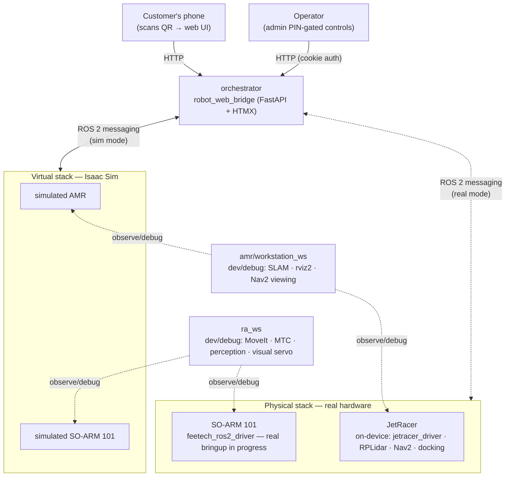

# robot-fulfillment

ROS 2 workstation packages for the JetRacer (AMR) + robot-arm fulfillment system.

### 📖 [**Read the documentation →**](https://blueocvn.github.io/BlueOC-Robotics-Research-and-Development/)

Setup guides, robot overviews, and use cases — hosted via GitHub Pages.

---

## Documentation

Full setup guides, concepts, and use cases live in [`docs/`](docs/) as a
[MkDocs Material](https://squidfunk.github.io/mkdocs-material/) site (published to
the link above via GitHub Pages). Preview it locally with
[uv](https://docs.astral.sh/uv/) — no `pip` or `venv` step needed:

```bash
# one-time: install uv
curl -LsSf https://astral.sh/uv/install.sh | sh

cd docs
uv sync                 # creates .venv and installs the locked deps
uv run mkdocs serve     # → http://127.0.0.1:8000 (live-reloads on save)
```

Build the static site instead of serving it:

```bash
cd docs
uv run mkdocs build     # outputs to docs/site/
```

| Section | What's in it |
|---|---|
| **Get Started** | Which workspace to set up first; shared concepts (ROS 2, DDS, Isaac Sim) |
| **Robot Arm (RA)** | Overview, setup guide, real-hardware bringup, pick-and-place + visual-servoing + imitation-learning use cases |
| **JetRacer (AMR)** | Overview, setup guide, navigate-and-deliver use case |
| **Robotic Solutions** | The combined RA + AMR pick-and-deliver flow, orchestrator |
| **Reference** | Calibration, third-party setup |

See [`docs/README.md`](docs/README.md) for how to add a page, change the theme,
or deploy to GitHub Pages.

## Architecture



**Current state:** the AMR runs on **real hardware**. `amr/jetracer_ws` is the
**on-device** stack that runs on the JetRacer itself (Jetson, ROS 2 Humble): base
driver (`jetracer_driver`), RPLidar, EKF odometry, Nav2, and AprilTag docking
(`opennav_docking`) — the physical robot maps, localizes, navigates, and docks.
`amr/workstation_ws` is a separate **workstation / Isaac Sim** stack (SLAM, Nav2,
ackermann control) used for development and simulation. The arm (`ra_ws`) is the
one still mid sim-to-real (real driver in place, closing the perception loop).

## Workspaces

The repo is split into independent colcon workspaces by concern. Each builds
on its own (`colcon build`) and they communicate only over the ROS 2 graph, so
they share a **DDS domain**, not a build space.

| Workspace          | Concern                                                        |
| ------------------ | ------------------------------------------------------------- |
| `amr/jetracer_ws/` | **On-device JetRacer** (Jetson, ROS 2 Humble): base driver (`jetracer_driver`), RPLidar, EKF odometry, Nav2, AprilTag docking (`opennav_docking`). The real robot — maps, localizes, navigates, docks. |
| `amr/workstation_ws/` | AMR **workstation / Isaac Sim** stack: SLAM, Nav2, ackermann control, Isaac Sim interfaces — for development and simulation. |
| `ra_ws/`           | SO-ARM 101 (5-DOF) arm on **ROS 2 Jazzy**: MoveIt 2, MoveIt Task Constructor, YOLO/AprilTag perception, image-based visual-servo grasp → refill → place. Runs against Isaac Sim **and** real hardware via `feetech_ros2_driver` (sim-to-real in progress). Also an imitation-learning path (LeRobot ACT). See [`ra_ws/README.md`](ra_ws/README.md) and the [docs](docs/). |
| `orchestrator/` | `robot_web_bridge` — HTTP/web UI + mission/state logic. Runs in the same Humble container as `amr/workstation_ws`. |

> **Note:** `ra_ws` targets **ROS 2 Jazzy (Ubuntu 24.04)** and is built and run
> natively (not inside a Docker container). It interoperates with the other
> workspaces over DDS as long as they share the same `ROS_DOMAIN_ID`. Arm docs:
> Setup Guide (`docs/docs/ra_setup.md`), Real-Hardware Bringup
> (`docs/docs/ra_hardware_bringup.md`), and Imitation Learning
> (`docs/docs/ra_imitation_learning.md`).

## Network setup

Real IPs are kept out of git. Copy the example and fill in your values:

```bash
cp network.env.example network.env
# edit network.env: WORKSTATION_IP, JETRACER_IP, DDS_INTERFACE, ROS_DOMAIN_ID
```

`network.env` is gitignored. The run scripts source it from the repo root, and
the DDS profiles (`/tmp/cyclonedds.xml`, `amr/workstation_ws/fastdds.xml`) are rendered
at runtime from `network.env` + `amr/workstation_ws/fastdds.xml.template`. Never commit
real IPs — put them only in `network.env`.

All workspaces must use the same `ROS_DOMAIN_ID` to see each other.

## Humble Docker setup

Two images, both at the repo root (shared, so neither lives inside a workspace):

| Image | Dockerfile | Base | Contains | Used by |
| --- | --- | --- | --- | --- |
| **Dev (both)** | `Dockerfile.dev` | `osrf/ros:humble-desktop-full` | `amr/workstation_ws` (SLAM/Nav2) + `robot_web_bridge` deps, GUI tools (rviz2) | `amr/workstation_ws/run_workstation.sh` |
| **Orchestrator only** | `Dockerfile.orchestrator` | `osrf/ros:humble-ros-base` | Just `robot_web_bridge` deps, no SLAM/Nav2, no GUI | `orchestrator/run_orchestrator.sh` |

Use **Dev** for local development (SLAM, Isaac Sim, and the web bridge
together). Use **Orchestrator only** to run/deploy `robot_web_bridge` on its
own — e.g. on a lighter machine, pointed at a robot (real or simulated)
elsewhere on the same DDS domain — without pulling in SLAM/Nav2/GUI weight.

**1. Build the image(s)** (tags must match the run scripts' defaults):

```bash
# from the repo root
docker build -f Dockerfile.dev -t jetracer-workstation:humble .

# only if you need the standalone orchestrator image too:
docker build -f Dockerfile.orchestrator -t robot-orchestrator:humble .
```

**2. Set up networking** (see [Network setup](#network-setup) above) — do this
before first run.

**3. Launch the dev container:**

```bash
# from the repo root
./amr/workstation_ws/run_workstation.sh          # interactive shell inside the container
./amr/workstation_ws/run_workstation.sh rviz2    # or: run one command then exit
```

This mounts `~/IsaacSim-ros_workspaces/humble_ws` (override with `WORKSPACE_HOST`)
into `/ros2_ws` in the container, forwards X11 for GUI apps (rviz2, rqt), and
configures CycloneDDS from your `network.env`. Set `USE_GPU=true` if you have
an NVIDIA GPU + `nvidia-container-toolkit` installed.

**4. Build the ROS packages** (first time, or after changes), inside the container:

```bash
cd /ros2_ws
colcon build --symlink-install
source install/setup.bash
```

## Running SLAM

Inside the Humble container (after sourcing `install/setup.bash`):

```bash
ros2 launch slam_custom slam_custom.launch.py
```

This brings up `slam_toolbox`'s online-async SLAM plus `rviz2` with the
project's preconfigured view (`slam_custom.rviz`). Useful arguments:

```bash
# Against real hardware clock instead of Isaac Sim's simulated clock:
ros2 launch slam_custom slam_custom.launch.py use_sim_time:=false

# Custom slam_toolbox params file:
ros2 launch slam_custom slam_custom.launch.py slam_params_file:=/path/to/params.yaml
```

`use_sim_time` defaults to `true` (the package was built around Carter/JetRacer
in Isaac Sim); `startup_delay` (default 5s) gives the sim clock time to
stabilize before `slam_toolbox` starts.

## Running the orchestrator client (web UI)

Two ways to run `robot_web_bridge`, depending on whether you're also running
`amr/workstation_ws` in the same session:

**Alongside `amr/workstation_ws`** (shares the Dev container — needs the same
`ROS_DOMAIN_ID` to reach the AMR's topics):

```bash
# 1. get into the Humble container (it doesn't launch one for you):
./amr/workstation_ws/run_workstation.sh

# 2. inside the container, build once then run:
cd /ros2_ws && colcon build --packages-select robot_web_bridge && source install/setup.bash
./orchestrator/run_web_bridge.sh
# — or directly: ros2 run robot_web_bridge server
```

**Standalone** (lean `Dockerfile.orchestrator` image, no SLAM/Nav2/GUI — the
robot it talks to, real or simulated, must be reachable on the same DDS domain):

```bash
./orchestrator/run_orchestrator.sh
# once inside the container:
cd /ros2_ws && colcon build --packages-select robot_web_bridge && source install/setup.bash
./run_web_bridge.sh
```

Either way, the container runs with `--network host`, so the web UI is
reachable directly on the host at **http://localhost:8088/?dock=dock0**. To let
a customer's phone reach it via QR code, expose it with `ngrok http 8088` (or
similar) from the host.

If `rclpy` isn't available (e.g. local dev outside either container), the
bridge falls back to a simulated backend automatically — see
[`orchestrator/src/robot_web_bridge/README.md`](orchestrator/src/robot_web_bridge/README.md)
for the admin API, `/docking_state` mapping, and dock registry config.

## Running everything together

Both pieces share one container (`run_workstation.sh` creates it; a second
terminal attaches to the same one with `docker exec` rather than launching a
second container):

```bash
# Terminal 1 — starts the Humble container (SLAM/nav/Isaac), reads network.env:
./amr/workstation_ws/run_workstation.sh

# Terminal 2 — attach to the SAME container, then run the web bridge:
docker exec -it isaacsim_humble_ws bash
source /opt/ros/humble/setup.bash && source /ros2_ws/install/setup.bash
./orchestrator/run_web_bridge.sh
```
