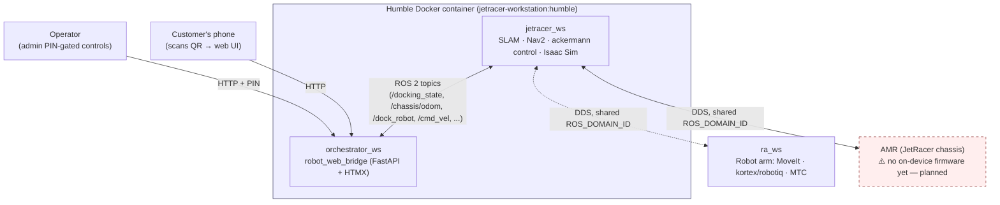

# robot-fulfillment

ROS 2 workstation packages for the JetRacer (AMR) + robot-arm fulfillment system.

## Architecture



**Current state:** `jetracer_ws` is the **workstation-side** control stack (SLAM,
Nav2, ackermann control, Isaac Sim) — it runs on the workstation, not on the
JetRacer. There is **no on-device JetRacer firmware in this repo yet**; the
workstation currently drives simulation (Isaac Sim) and will drive the real
chassis once firmware is added.

## Workspaces

The repo is split into independent colcon workspaces by concern. Each builds
on its own (`colcon build`) and they communicate only over the ROS 2 graph, so
they share a **DDS domain**, not a build space.

| Workspace          | Concern                                                        |
| ------------------ | ------------------------------------------------------------- |
| `jetracer_ws/`     | AMR workstation control: SLAM, Nav2, ackermann control, Isaac Sim, interfaces. No on-device JetRacer firmware yet — planned. |
| `ra_ws/`           | Robot arm: MoveIt, kortex/robotiq drivers, MTC                |
| `orchestrator_ws/` | `robot_web_bridge` — HTTP/web UI + mission/state logic. Runs in the same Humble container as `jetracer_ws`. |

## Network setup

Real IPs are kept out of git. Copy the example and fill in your values:

```bash
cp network.env.example network.env
# edit network.env: WORKSTATION_IP, JETRACER_IP, DDS_INTERFACE, ROS_DOMAIN_ID
```

`network.env` is gitignored. The run scripts source it from the repo root, and
the DDS profiles (`/tmp/cyclonedds.xml`, `jetracer_ws/fastdds.xml`) are rendered
at runtime from `network.env` + `jetracer_ws/fastdds.xml.template`. Never commit
real IPs — put them only in `network.env`.

All workspaces must use the same `ROS_DOMAIN_ID` to see each other.

## Humble Docker setup

Two images, both at the repo root (shared, so neither lives inside a workspace):

| Image | Dockerfile | Base | Contains | Used by |
| --- | --- | --- | --- | --- |
| **Dev (both)** | `Dockerfile.dev` | `osrf/ros:humble-desktop-full` | `jetracer_ws` (SLAM/Nav2) + `robot_web_bridge` deps, GUI tools (rviz2) | `jetracer_ws/run_workstation.sh` |
| **Orchestrator only** | `Dockerfile.orchestrator` | `osrf/ros:humble-ros-base` | Just `robot_web_bridge` deps, no SLAM/Nav2, no GUI | `orchestrator_ws/run_orchestrator.sh` |

Use **Dev** for local development (SLAM, Isaac Sim, and the web bridge
together). Use **Orchestrator only** to run/deploy `robot_web_bridge` on its
own — e.g. on a lighter machine, pointed at a robot (real or simulated)
elsewhere on the same DDS domain — without pulling in SLAM/Nav2/GUI weight.

**1. Build the image(s)** (tags must match the run scripts' defaults):

```bash
# from the repo root
docker build -f Dockerfile.dev -t jetracer-workstation:humble .

# only if you need the standalone orchestrator image too:
docker build -f Dockerfile.orchestrator -t robot-orchestrator:humble .
```

**2. Set up networking** (see [Network setup](#network-setup) above) — do this
before first run.

**3. Launch the dev container:**

```bash
# from the repo root
./jetracer_ws/run_workstation.sh          # interactive shell inside the container
./jetracer_ws/run_workstation.sh rviz2    # or: run one command then exit
```

This mounts `~/IsaacSim-ros_workspaces/humble_ws` (override with `WORKSPACE_HOST`)
into `/ros2_ws` in the container, forwards X11 for GUI apps (rviz2, rqt), and
configures CycloneDDS from your `network.env`. Set `USE_GPU=true` if you have
an NVIDIA GPU + `nvidia-container-toolkit` installed.

**4. Build the ROS packages** (first time, or after changes), inside the container:

```bash
cd /ros2_ws
colcon build --symlink-install
source install/setup.bash
```

## Running SLAM

Inside the Humble container (after sourcing `install/setup.bash`):

```bash
ros2 launch slam_custom slam_custom.launch.py
```

This brings up `slam_toolbox`'s online-async SLAM plus `rviz2` with the
project's preconfigured view (`slam_custom.rviz`). Useful arguments:

```bash
# Against real hardware clock instead of Isaac Sim's simulated clock:
ros2 launch slam_custom slam_custom.launch.py use_sim_time:=false

# Custom slam_toolbox params file:
ros2 launch slam_custom slam_custom.launch.py slam_params_file:=/path/to/params.yaml
```

`use_sim_time` defaults to `true` (the package was built around Carter/JetRacer
in Isaac Sim); `startup_delay` (default 5s) gives the sim clock time to
stabilize before `slam_toolbox` starts.

## Running the orchestrator client (web UI)

Two ways to run `robot_web_bridge`, depending on whether you're also running
`jetracer_ws` in the same session:

**Alongside `jetracer_ws`** (shares the Dev container — needs the same
`ROS_DOMAIN_ID` to reach the AMR's topics):

```bash
# 1. get into the Humble container (it doesn't launch one for you):
./jetracer_ws/run_workstation.sh

# 2. inside the container, build once then run:
cd /ros2_ws && colcon build --packages-select robot_web_bridge && source install/setup.bash
./orchestrator_ws/run_web_bridge.sh
# — or directly: ros2 run robot_web_bridge server
```

**Standalone** (lean `Dockerfile.orchestrator` image, no SLAM/Nav2/GUI — the
robot it talks to, real or simulated, must be reachable on the same DDS domain):

```bash
./orchestrator_ws/run_orchestrator.sh
# once inside the container:
cd /ros2_ws && colcon build --packages-select robot_web_bridge && source install/setup.bash
./run_web_bridge.sh
```

Either way, the container runs with `--network host`, so the web UI is
reachable directly on the host at **http://localhost:8088/?dock=dock0**. To let
a customer's phone reach it via QR code, expose it with `ngrok http 8088` (or
similar) from the host.

If `rclpy` isn't available (e.g. local dev outside either container), the
bridge falls back to a simulated backend automatically — see
[`orchestrator_ws/src/robot_web_bridge/README.md`](orchestrator_ws/src/robot_web_bridge/README.md)
for the admin API, `/docking_state` mapping, and dock registry config.

## Running everything together

Both pieces share one container (`run_workstation.sh` creates it; a second
terminal attaches to the same one with `docker exec` rather than launching a
second container):

```bash
# Terminal 1 — starts the Humble container (SLAM/nav/Isaac), reads network.env:
./jetracer_ws/run_workstation.sh

# Terminal 2 — attach to the SAME container, then run the web bridge:
docker exec -it isaacsim_humble_ws bash
source /opt/ros/humble/setup.bash && source /ros2_ws/install/setup.bash
./orchestrator_ws/run_web_bridge.sh
```
