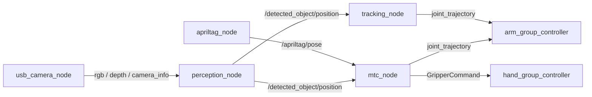

# ROS 2 Interfaces — Robot Arm

Topics, services and actions for the SO-ARM 101. The pipeline runs
**perception → target selection → motion planning → controller**, and you can tap
in at any stage.

## Perception outputs

Published by `perception_node`. These are the topics most teams consume.

| Topic | Type | Meaning |
|---|---|---|
| `/detected_object/position` | `geometry_msgs/msg/PointStamped` | Target object in `base_frame` — the main detection output |
| `/detected_object/pixel` | `std_msgs/msg/Float32MultiArray` | Detection in image coordinates |
| `/detected_object/depth` | `std_msgs/msg/Float32` | Depth at the detection, metres |
| `/detected_object/bbox_marker` | `visualization_msgs/msg/Marker` | RViz bounding box |
| `/detected_cups` | `geometry_msgs/msg/PoseArray` | All cup detections this frame |
| `/detected_tray/position` | `geometry_msgs/msg/PointStamped` | Tray centroid — the place target |
| `/detected_tray/pixel` | `std_msgs/msg/Float32MultiArray` | Tray in image coordinates |
| `/perception/debug_image` | `sensor_msgs/msg/Image` | Annotated view — check this first when debugging |
| `/perception/tray_debug_image` | `sensor_msgs/msg/Image` | Tray-segmentation debug view |

### Camera inputs it subscribes to

For each camera namespace (`top_cam` eye-to-hand, `arm_cam` eye-in-hand):

| Topic | Type |
|---|---|
| `/<ns>/rgb` | `sensor_msgs/msg/Image` |
| `/<ns>/depth` | `sensor_msgs/msg/Image` |
| `/<ns>/camera_info` | `sensor_msgs/msg/CameraInfo` |

### Key parameters

| Parameter | Default | Meaning |
|---|---|---|
| `active_camera` | `top_cam` | Which camera drives detection |
| `camera_eth_ns` | `top_cam` | Eye-to-hand namespace |
| `camera_eih_ns` | `arm_cam` | Eye-in-hand namespace |
| `target_classes` | `cup,bottle` | YOLO classes to accept |
| `yolo_model` | `yolo11n.pt` | Model weights |
| `conf_threshold` | `0.25` | Minimum detection confidence |
| `base_frame` | `world` | Frame detections are reported in |
| `eth_use_ray_plane` | `true` | Use ray–plane intersection instead of depth |
| `eth_plane_z` | `0.05986` | Grasp-height plane, metres |
| `eth_x_correction` / `_y_` / `_z_` | `0.0` | Manual extrinsic nudges |

!!! warning "Ray–plane assumes a known object height"

    With `eth_use_ray_plane: true`, position comes from intersecting the camera
    ray with the plane at `eth_plane_z` — **not** from the depth image. If the
    object's actual grasp height differs from `0.05986 m`, every detection is
    laterally offset, and the error grows with distance from the optical axis.
    The `eth_*_correction` parameters exist to paper over calibration error; if
    you find yourself using them heavily, re-run
    [camera calibration](../ra_camera_calibration.md) instead.

## AprilTag

Published by `apriltag_node`.

| Topic | Type | Meaning |
|---|---|---|
| `/apriltag/pose` | `geometry_msgs/msg/PoseStamped` | Tag pose in `world_frame` |
| `/apriltag/pose_cam` | `geometry_msgs/msg/PoseStamped` | Tag pose in the camera frame |
| `/apriltag/pixel` | `std_msgs/msg/Float32MultiArray` | Tag centre in image coordinates |
| `/apriltag/marker` | `visualization_msgs/msg/Marker` | RViz marker |
| `/apriltag/debug_image` | `sensor_msgs/msg/Image` | Annotated view |

| Parameter | Default | Meaning |
|---|---|---|
| `tag_size` | `0.05` | Tag edge length, metres |
| `tag_family` | `36h11` | AprilTag family |
| `world_frame` | `world` | Output frame for `/apriltag/pose` |
| `target_id` | `-1` | Specific tag ID, or `-1` for any |

## Cup handle detection

Published by `handle_detector` — finds the mug handle so the gripper approaches
from a graspable angle.

| Topic | Type | Meaning |
|---|---|---|
| `/cup_handle/bearing` | `std_msgs/msg/Float32` | Handle bearing, radians |
| `/cup_handle/required_turn` | `std_msgs/msg/Float32` | Turn needed to face the handle |
| `/cup_handle/state` | `std_msgs/msg/Float32MultiArray` | Full detector state |
| `/cup_handle/debug_image` | `sensor_msgs/msg/Image` | Annotated view |

## Motion — `mtc_node`

The MoveIt Task Constructor pick→fill→place pipeline.

**Subscribes:** `/detected_object/position`, `/detected_tray/position`,
`/detected_cups`, `/detected_object/pixel`, `/detected_object/depth`,
`/apriltag/pose`, `/joint_states`

**Publishes:**

| Topic | Type | Notes |
|---|---|---|
| `/arm_group_controller/joint_trajectory` | `trajectory_msgs/msg/JointTrajectory` | Arm command |
| `/detected_object/cup_marker` | `visualization_msgs/msg/Marker` | Latched |
| `/claw_tcp_marker` | `visualization_msgs/msg/Marker` | Latched; gated by `show_tcp_marker` |

**Action client:** `/hand_group_controller/gripper_cmd`
(`control_msgs/action/GripperCommand`) — the gripper.

## Visual servoing — `tracking_node`

Closed-loop tracking of a detected object. Calls MoveIt IK each cycle and steps
the arm a fraction of the way toward the solution.

**Service client:** `/compute_ik` (`moveit_msgs/srv/GetPositionIK`)
**Subscribes:** `/joint_states`, plus `object_topic`
**Publishes:** `command_topic`

| Parameter | Default | Meaning |
|---|---|---|
| `group` | `arm_group` | Planning group |
| `ik_link` | `gripper` | IK tip link |
| `object_topic` | `/detected_object/position` | Target in |
| `command_topic` | `/arm_group_controller/joint_trajectory` | Command out |
| `rate` | `10.0` | Control loop Hz |
| `standoff` | `0.12` | Metres to hold back along approach |
| `gain` | `0.35` | Fraction of the way to IK solution per cycle |
| `max_joint_step` | `0.15` | Per-cycle joint clamp, radians |
| `target_timeout` | `1.0` | Stop tracking after this long without a detection |
| `ik_timeout` | `0.05` | Per-call IK budget, seconds |
| `avoid_collisions` | `true` | Collision-aware IK |
| `target_ema` | `0.4` | Smoothing weight on new samples |
| `pos_deadband` | `0.01` | Ignore target moves below this, metres |
| `joint_deadband` | `0.01` | Hold if IK is within this of current, radians |

!!! danger "`tracking_node` and `mtc_node` both drive the arm"

    Both publish to `/arm_group_controller/joint_trajectory`, and nothing
    arbitrates between them. Run **one at a time**. `gain` and `max_joint_step`
    are the safety envelope for visual servoing — raising them makes the arm
    snap toward IK solutions, and a bad detection becomes a fast unwanted motion.

## Camera — `usb_camera_node`

| Parameter | Default | Meaning |
|---|---|---|
| `video_device` | `/dev/video2` | V4L2 device |
| `camera_ns` | `arm_cam` | Namespace for published topics |
| `width` / `height` | `640` / `480` | Capture resolution |
| `fps` | `30.0` | Frame rate |
| `fourcc` | `MJPG` | Capture format |
| `flip` | `99` | OpenCV flip code; `99` = no flip |
| `publish_camera_info` | `true` | Emit `camera_info` |
| `publish_depth` | `true` | Emit a synthetic depth image |
| `fx` / `fy` | `500.0` | Focal lengths, pixels |
| `cx` / `cy` | `-1.0` | Principal point; `<0` means image centre |
| `undistort` | `false` | Apply distortion correction |
| `d0`…`d4` | `0.0` | Distortion coefficients k1, k2, p1, p2, k3 |

!!! warning "Default intrinsics are placeholders, not measurements"

    `fx`/`fy` default to `500.0` and the principal point to the image centre.
    These are guesses. Any unprojection built on them inherits the error — run
    [camera calibration](../ra_camera_calibration.md) and supply real values
    before trusting metric positions.

## See also

- [Camera calibration](../ra_camera_calibration.md) — extrinsics and intrinsics
- [Launch entry points](launch.md) — bringing the arm up
- [Pick and place](../ra_pick_and_place.md) — the MTC pipeline in context
