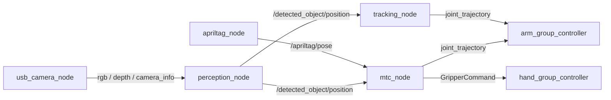

# ROS 2 Interfaces — Robot Arm

Topic, service và action cho SO-ARM 101. Pipeline chạy theo thứ tự
**perception → chọn mục tiêu → lập kế hoạch chuyển động → controller**, và bạn
có thể can thiệp ở bất kỳ giai đoạn nào.

## Perception outputs

Do `perception_node` publish. Đây là những topic mà phần lớn các đội sẽ dùng.

| Topic | Kiểu | Ý nghĩa |
|---|---|---|
| `/detected_object/position` | `geometry_msgs/msg/PointStamped` | Vật mục tiêu trong `base_frame` — đầu ra nhận dạng chính |
| `/detected_object/pixel` | `std_msgs/msg/Float32MultiArray` | Kết quả nhận dạng theo tọa độ ảnh |
| `/detected_object/depth` | `std_msgs/msg/Float32` | Độ sâu tại điểm nhận dạng, mét |
| `/detected_object/bbox_marker` | `visualization_msgs/msg/Marker` | Khung bao hiển thị trong RViz |
| `/detected_cups` | `geometry_msgs/msg/PoseArray` | Toàn bộ cốc nhận dạng được trong khung hình |
| `/detected_tray/position` | `geometry_msgs/msg/PointStamped` | Tâm khay — mục tiêu để đặt |
| `/detected_tray/pixel` | `std_msgs/msg/Float32MultiArray` | Khay theo tọa độ ảnh |
| `/perception/debug_image` | `sensor_msgs/msg/Image` | Ảnh có chú thích — hãy xem cái này đầu tiên khi gỡ lỗi |
| `/perception/tray_debug_image` | `sensor_msgs/msg/Image` | Ảnh gỡ lỗi phần phân vùng khay |

### Camera inputs it subscribes to

Cho mỗi namespace camera (`top_cam` eye-to-hand, `arm_cam` eye-in-hand):

| Topic | Kiểu |
|---|---|
| `/<ns>/rgb` | `sensor_msgs/msg/Image` |
| `/<ns>/depth` | `sensor_msgs/msg/Image` |
| `/<ns>/camera_info` | `sensor_msgs/msg/CameraInfo` |

### Key parameters

| Tham số | Mặc định | Ý nghĩa |
|---|---|---|
| `active_camera` | `top_cam` | Camera nào dẫn dắt việc nhận dạng |
| `camera_eth_ns` | `top_cam` | Namespace camera eye-to-hand |
| `camera_eih_ns` | `arm_cam` | Namespace camera eye-in-hand |
| `target_classes` | `cup,bottle` | Các lớp YOLO được chấp nhận |
| `yolo_model` | `yolo11n.pt` | Trọng số mô hình |
| `conf_threshold` | `0.25` | Ngưỡng tin cậy tối thiểu |
| `base_frame` | `world` | Frame mà kết quả được báo về |
| `eth_use_ray_plane` | `true` | Dùng giao tia–mặt phẳng thay vì ảnh độ sâu |
| `eth_plane_z` | `0.05986` | Mặt phẳng ở độ cao gắp, mét |
| `eth_x_correction` / `_y_` / `_z_` | `0.0` | Hiệu chỉnh extrinsics thủ công |

!!! warning "Giao tia–mặt phẳng giả định biết trước chiều cao vật"

    Khi `eth_use_ray_plane: true`, vị trí được tính bằng cách giao tia camera với
    mặt phẳng tại `eth_plane_z` — **không phải** từ ảnh độ sâu. Nếu chiều cao gắp
    thực tế của vật khác `0.05986 m`, mọi kết quả nhận dạng đều bị lệch ngang, và
    sai số tăng dần theo khoảng cách tới trục quang. Các tham số `eth_*_correction`
    sinh ra để che sai số hiệu chuẩn; nếu bạn thấy mình dùng chúng quá nhiều,
    hãy chạy lại [hiệu chuẩn camera](../ra_camera_calibration.md) thay vì tiếp tục.

## AprilTag

Do `apriltag_node` publish.

| Topic | Kiểu | Ý nghĩa |
|---|---|---|
| `/apriltag/pose` | `geometry_msgs/msg/PoseStamped` | Pose của tag trong `world_frame` |
| `/apriltag/pose_cam` | `geometry_msgs/msg/PoseStamped` | Pose của tag trong frame camera |
| `/apriltag/pixel` | `std_msgs/msg/Float32MultiArray` | Tâm tag theo tọa độ ảnh |
| `/apriltag/marker` | `visualization_msgs/msg/Marker` | Marker cho RViz |
| `/apriltag/debug_image` | `sensor_msgs/msg/Image` | Ảnh có chú thích |

| Tham số | Mặc định | Ý nghĩa |
|---|---|---|
| `tag_size` | `0.05` | Cạnh tag, mét |
| `tag_family` | `36h11` | Họ AprilTag |
| `world_frame` | `world` | Frame đầu ra cho `/apriltag/pose` |
| `target_id` | `-1` | ID tag cụ thể, hoặc `-1` để nhận mọi tag |

## Cup handle detection

Do `handle_detector` publish — tìm quai cốc để gripper tiếp cận từ góc có
thể gắp được.

| Topic | Kiểu | Ý nghĩa |
|---|---|---|
| `/cup_handle/bearing` | `std_msgs/msg/Float32` | Phương vị của quai, radian |
| `/cup_handle/required_turn` | `std_msgs/msg/Float32` | Góc cần xoay để đối diện quai |
| `/cup_handle/state` | `std_msgs/msg/Float32MultiArray` | Toàn bộ trạng thái detector |
| `/cup_handle/debug_image` | `sensor_msgs/msg/Image` | Ảnh có chú thích |

## Motion — `mtc_node`

Pipeline gắp → rót → đặt của MoveIt Task Constructor.

**Subscribe:** `/detected_object/position`, `/detected_tray/position`,
`/detected_cups`, `/detected_object/pixel`, `/detected_object/depth`,
`/apriltag/pose`, `/joint_states`

**Publish:**

| Topic | Kiểu | Ghi chú |
|---|---|---|
| `/arm_group_controller/joint_trajectory` | `trajectory_msgs/msg/JointTrajectory` | Lệnh cho cánh tay |
| `/detected_object/cup_marker` | `visualization_msgs/msg/Marker` | Có latch |
| `/claw_tcp_marker` | `visualization_msgs/msg/Marker` | Có latch; phụ thuộc `show_tcp_marker` |

**Action client:** `/hand_group_controller/gripper_cmd`
(`control_msgs/action/GripperCommand`) — gripper.

## Visual servoing — `tracking_node`

Closed-loop tracking một vật đã nhận dạng. Mỗi chu kỳ gọi IK của MoveIt và dịch cánh tay
một phần quãng đường tới lời giải.

**Service client:** `/compute_ik` (`moveit_msgs/srv/GetPositionIK`)
**Subscribe:** `/joint_states`, cùng với `object_topic`
**Publish:** `command_topic`

| Tham số | Mặc định | Ý nghĩa |
|---|---|---|
| `group` | `arm_group` | Nhóm lập kế hoạch |
| `ik_link` | `gripper` | Link đầu mút cho IK |
| `object_topic` | `/detected_object/position` | Mục tiêu vào |
| `command_topic` | `/arm_group_controller/joint_trajectory` | Lệnh ra |
| `rate` | `10.0` | Tần số vòng điều khiển, Hz |
| `standoff` | `0.12` | Khoảng lùi theo hướng tiếp cận, mét |
| `gain` | `0.35` | Tỉ lệ quãng đường tiến tới lời giải IK mỗi chu kỳ |
| `max_joint_step` | `0.15` | Giới hạn bước khớp mỗi chu kỳ, radian |
| `target_timeout` | `1.0` | Ngừng bám sau khoảng này nếu không có kết quả mới |
| `ik_timeout` | `0.05` | Ngân sách thời gian mỗi lần gọi IK, giây |
| `avoid_collisions` | `true` | IK có xét va chạm |
| `target_ema` | `0.4` | Trọng số làm mượt cho mẫu mới |
| `pos_deadband` | `0.01` | Bỏ qua dịch chuyển mục tiêu nhỏ hơn mức này, mét |
| `joint_deadband` | `0.01` | Giữ nguyên nếu IK nằm trong khoảng này so với hiện tại, radian |

!!! danger "`tracking_node` và `mtc_node` cùng điều khiển cánh tay"

    Cả hai đều publish tới `/arm_group_controller/joint_trajectory`, và không có
    cơ chế nào phân xử. Hãy chạy **từng cái một**. `gain` và `max_joint_step` là
    hai tham số giữ an toàn cho visual servoing — tăng lên thì cánh tay giật
    mạnh về phía lời giải IK, và một kết quả nhận dạng sai sẽ thành cú vung tay
    ngoài ý muốn.

## Camera — `usb_camera_node`

| Tham số | Mặc định | Ý nghĩa |
|---|---|---|
| `video_device` | `/dev/video2` | Thiết bị V4L2 |
| `camera_ns` | `arm_cam` | Namespace cho các topic được publish |
| `width` / `height` | `640` / `480` | Độ phân giải thu hình |
| `fps` | `30.0` | Tốc độ khung hình |
| `fourcc` | `MJPG` | Định dạng thu hình |
| `flip` | `99` | Mã lật của OpenCV; `99` = không lật |
| `publish_camera_info` | `true` | Phát `camera_info` |
| `publish_depth` | `true` | Phát ảnh độ sâu tổng hợp |
| `fx` / `fy` | `500.0` | Tiêu cự, đơn vị pixel |
| `cx` / `cy` | `-1.0` | Điểm chính; `<0` nghĩa là tâm ảnh |
| `undistort` | `false` | Áp dụng hiệu chỉnh méo |
| `d0`…`d4` | `0.0` | Hệ số méo k1, k2, p1, p2, k3 |

!!! warning "Intrinsics mặc định là giá trị tạm, không phải số đo"

    `fx`/`fy` mặc định `500.0` và điểm chính mặc định là tâm ảnh. Đây là những con
    số phỏng đoán. Mọi phép unprojection dựa trên chúng đều thừa hưởng sai số — hãy
    chạy [hiệu chuẩn camera](../ra_camera_calibration.md) và cung cấp giá trị thật
    trước khi tin vào vị trí đo được.

## See also

- [Hiệu chuẩn camera](../ra_camera_calibration.md) — extrinsics và intrinsics
- [Điểm khởi chạy](launch.md) — cách dựng cánh tay lên
- [Gắp và đặt](../ra_pick_and_place.md) — pipeline MTC trong bối cảnh thực tế
